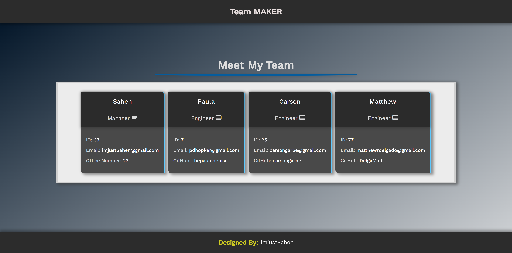

# Object-Oriented Programming: Team Profile Generator

## <ins>Project Title

Team MAKER

## <ins>Table of contents

- [General info](#general-info)
- [Description](#description)
- [Working Application](#working-application)
- [Demo](#demo)
- [Credits](#credits)
- [License](#license)

## <ins>General info

My task was to build a Node.js command-line application that takes in information about employees on a software engineering team, then generates an HTML webpage that displays summaries for each person. While also using Jest to be able to test my code thoroughly.

I spent some time working on reducing the chance of the wrong type of data being allowed during the prompts. Example being using isNaN() to insure that a user can only submit a number for those specific questions but I found that this then allowed the user to skip the question without input. So I had to add a logical operator (||) to not allow an input less than 1. A small thing but I felt improved the UI a ton.

## <ins>Description

<li>User is able to run 'npm run test' to verify the the different units are working properly</li>
<li>User is able to run 'node index.js' to initiate prompts to start building their team profile</li>
<li>After answering all of the prompts and adding team members, a user can open up the /dist/index.html file to find their information has been added</li>
<li>Finally, they can run a live server of the new html file to view a clean UI with their team members listed</li>

## <ins>Working Application

[Deployed Application](https://imjustsahen.github.io/AS10-Team-Profile-Builder/)

[Github Repository](https://github.com/imjustSahen/AS10-Team-Profile-Builder)

## <ins>Demo

 

[Recording of Application](https://drive.google.com/file/d/14fJ4rVz_gsE0k9cXkOTU61MxB75dpMV6/view?usp=sharing)

## <ins>Credits

- [MDN Web Docs](https://developer.mozilla.org/en-US/)

- [W3Schools](https://www.w3schools.com/)

- [A Complete Guide to Flexbox](https://css-tricks.com/snippets/css/a-guide-to-flexbox/)

 

## <ins>License

MIT License

Copyright (c) 2022 Sahen
